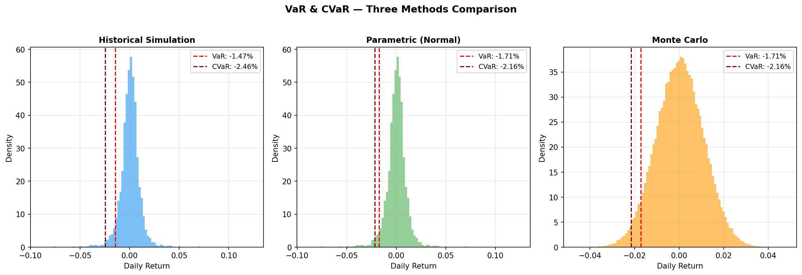
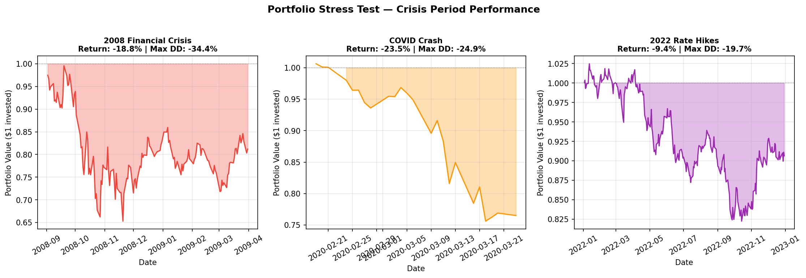
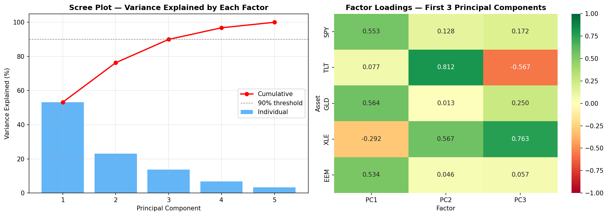

# Portfolio Risk Engine — VaR, Stress Testing & Factor Analysis

A quantitative risk model built from scratch in Python, implementing 
three VaR methodologies, historical stress testing, and PCA factor 
decomposition on a multi-asset portfolio.

## Portfolio

5-asset diversified portfolio reflecting a typical balanced allocation:

| Ticker | Asset Class | Weight |
|--------|-------------|--------|
| SPY | US Equities | 40% |
| TLT | Long-term Treasuries | 25% |
| GLD | Gold | 15% |
| XLE | Energy | 10% |
| EEM | Emerging Markets | 10% |

## Methodology

### 1. Value at Risk — Three Methods

| Method | Approach | Key Assumption |
|--------|----------|----------------|
| Historical Simulation | Empirical return distribution | No distributional assumption |
| Parametric (Normal) | Analytical normal distribution | Returns are normally distributed |
| Monte Carlo | 100,000 simulated paths | Normal distribution with historical params |

### 2. Stress Testing
Portfolio performance backtested against three major crisis periods:
- **2008 Financial Crisis** (Sep 2008 — Mar 2009)
- **COVID Crash** (Feb 19 — Mar 23, 2020)
- **2022 Rate Hike Cycle** (Jan — Dec 2022)

### 3. PCA Factor Decomposition
Principal Component Analysis decomposes portfolio variance into 
systematic risk factors:
- **PC1 (53.2%)** — Broad market / risk-on factor (SPY, GLD, EEM)
- **PC2 (23.1%)** — Interest rate / safe haven factor (TLT dominant)
- **PC3 (13.7%)** — Energy / commodity factor (XLE dominant)

Just 3 factors explain 90% of portfolio variance.

## Results

### VaR Comparison (95% Confidence)

| Method | VaR | CVaR |
|--------|-----|------|
| Historical Simulation | -1.47% | -2.46% |
| Parametric (Normal) | -1.71% | -2.16% |
| Monte Carlo | -1.71% | -2.16% |



### Stress Test Results

| Scenario | Total Return | Max Drawdown | Crisis VaR |
|----------|-------------|--------------|------------|
| 2008 Financial Crisis | -18.8% | -34.4% | -5.09% |
| COVID Crash | -23.5% | -24.9% | -7.49% |
| 2022 Rate Hikes | -9.4% | -19.7% | -1.58% |



### Key Finding
Baseline VaR of -1.47% expanded to -7.49% during COVID — five times 
worse than normal-period models predicted. This demonstrates why 
regulators (Basel III) mandate stress testing alongside VaR: models 
trained on calm periods systematically underestimate tail risk.



## Tech Stack
- Python 3.10
- pandas, numpy, scipy, scikit-learn
- yfinance (market data)
- matplotlib, seaborn

## How to Run
```bash
pip install numpy pandas matplotlib seaborn yfinance scipy scikit-learn
jupyter notebook stress_testing.ipynb
```