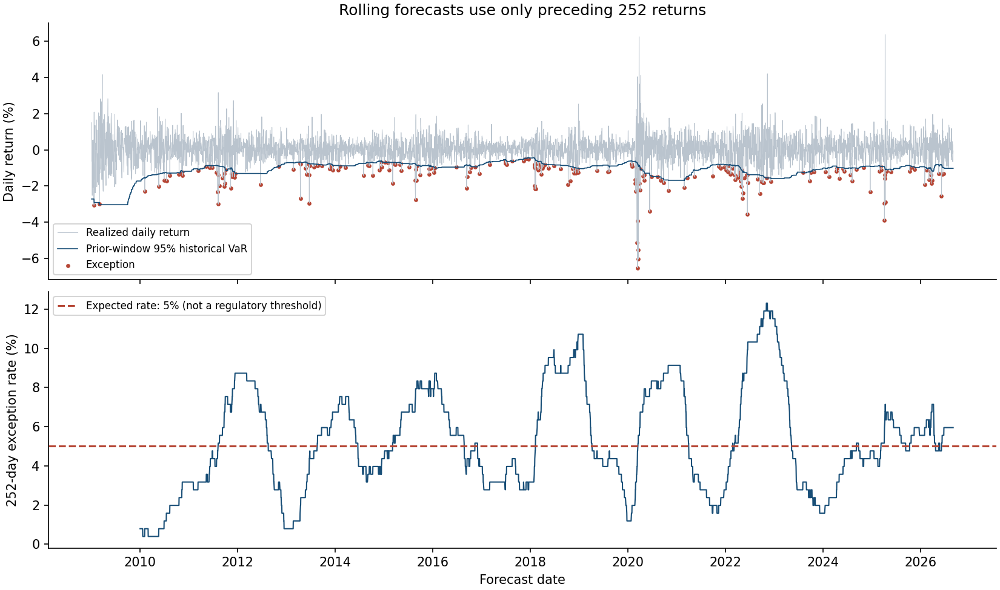

# Portfolio Risk Engine — Reproducible VaR, Coverage Tests & Stress Analysis

Python analysis of a fixed five-ETF portfolio. It compares historical and Gaussian tail estimates, evaluates rolling historical VaR, and distinguishes realized crisis-window statistics from forecasts. The current analysis uses **frozen adjusted prices from 2008-01-02 through 2026-08-31**.

## Main finding

The 95% historical VaR backtest recorded **230 exceptions in 4,442 forecast days (5.18%, versus 5% expected)** from 2009-01-02 through 2026-08-31. Kupiec unconditional coverage was not rejected at 5% (**p = 0.589**), but Christoffersen first-order independence was rejected (**p = 0.00233**), as was combined conditional coverage (**p = 0.00839**).

**An aggregate exception rate close to target did not establish adequate conditional coverage in this sample.** There were 23 exception-to-exception transitions: the next-day hit rate was 10.0% after a hit versus about 4.92% after a non-hit. These are sample diagnostics, not proof of production model validity or a regulatory approval. No Basel traffic-light classification is used.

## Additional observations

| Fixed-sample analysis | Result | Interpretation |
|---|---|---|
| Historical vs Gaussian 95% VaR | -1.13% vs -1.28% | Gaussian VaR is more negative in this sample |
| Historical vs Gaussian 95% ES | -1.88% vs -1.62% | Gaussian ES is less negative despite its more conservative VaR |
| First 3 PCA components | 89.66% | Variance of **standardized asset returns**, not weighted portfolio variance |
| COVID-window realized 95% VaR | -5.96% | 5.26x the full-sample magnitude; descriptive comparison, not a forecast error |

[Verification summary](VERIFICATION.md) · [Full results and plots](results/REPORT.md) · [Exact numbers](results/summary.json) · [Dated forecasts and exceptions](results/daily_backtest.csv)



## Portfolio and definitions

| Asset | Weight |
|---|---:|
| SPY | 40% |
| TLT | 25% |
| GLD | 15% |
| XLE | 10% |
| EEM | 10% |

- Daily simple adjusted-close returns; constant target weights imply frictionless **daily rebalancing**, not buy-and-hold. Costs and liquidity are not modeled.
- Signed-return convention: VaR is the lower 5th percentile; ES is mean return at or below that threshold. More negative means a larger loss.
- Each one-day historical VaR forecast uses the **preceding 252 returns**, never the return being tested. Separate 252-day rolling hit rates are descriptive.
- Kupiec POF uses all observations. Independence uses adjacent hit transitions, conditional on the first observation. Combined CC adds the two LR statistics; asymptotic chi-square degrees of freedom are 1, 1 and 2, respectively.
- Gaussian Monte Carlo draws 100,000 **portfolio returns**, not asset paths; seed 42. It is not an independent heavy-tail model.
- PCA standardizes each asset series and analyzes the correlation structure. Portfolio weights are not inputs. Component signs/economic labels are not unique.
- Stress VaR is calculated **inside each realized crisis window**. The baseline uses the full sample and includes those crises. No out-of-sample forecast failure is inferred from their ratio. Drawdown includes initial capital at the window start; earlier peaks are outside its scope.

## Reproduce offline

Use Python 3.12. `requirements-lock.txt` pins the resolved environment; direct dependencies are listed in `requirements.txt`.

```bash
python -m venv .venv
source .venv/bin/activate
python -m pip install -r requirements-lock.txt
python scripts/run_analysis.py
python -m pytest -q
```

`stress_testing.ipynb` calls the same analysis functions and includes executed tables. It reads the frozen CSV, not live Yahoo data. `scripts/run_analysis.py` regenerates result tables and plots without overwriting the snapshot or test baseline. Use `--output /path/to/separate/results` for an independent rerun.

## Data provenance and integrity

`data/snapshot_2026-08-31/manifest.json` records the acquisition timestamp, source, date semantics, actual date range, preprocessing, and hashes of the raw vendor response and adjusted-close CSV. `analysis_config.json` is hashed too. The end date is inclusive; Yahoo's exclusive request boundary is 2026-09-01. CSV values are stored with 17 significant digits and loaded in round-trip mode.

The one-time `scripts/freeze_data.py` downloads Yahoo's **Adj Close** field with `auto_adjust=False`, retaining the raw price/action fields as well. It refuses to overwrite the snapshot. The default analysis never downloads data. This is a later-acquired vendor-adjusted historical snapshot, **not point-in-time vendor data**. Historical revisions can affect a newly acquired snapshot.

## Validation and limits

Tests cover formula boundaries, chronology, forecast-day exclusion, a published POF reference, hand-calculated transition likelihoods, fixed-data regressions, data tampering, raw/clean CSV consistency, and independent reconstruction of headline statistics. Frozen baselines are reviewed artifacts; CI does not update them automatically. Passing tests establishes those checks, not universal financial correctness. Test networking is blocked.

Parameters, tickers, and weights are retrospectively specified. No untouched strategy-selection holdout or production trading record is claimed. The tests are asymptotic and do not prove independence at every lag; short stress windows give noisy empirical tail estimates. Validation of regulatory capital models is outside this project's scope.

The previous README's 5.29%, 231/4,370 and other figures could not be tied to a frozen input file; they are replaced, not presented as replicated results. `BASELINE.md` and `REFACTOR_PLAN.md` are clearly labeled historical notes. `VaR Simulation.ipynb` is a separate **legacy NVDA demonstration**, outside this validated five-asset workflow.

References: [Kupiec POF](https://www.mathworks.com/help/risk/varbacktest.pof.html), [Christoffersen independence](https://www.mathworks.com/help/risk/varbacktest.cci.html), [conditional coverage](https://www.mathworks.com/help/risk/varbacktest.cc.html).
