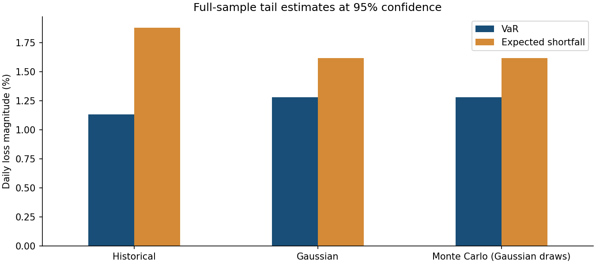
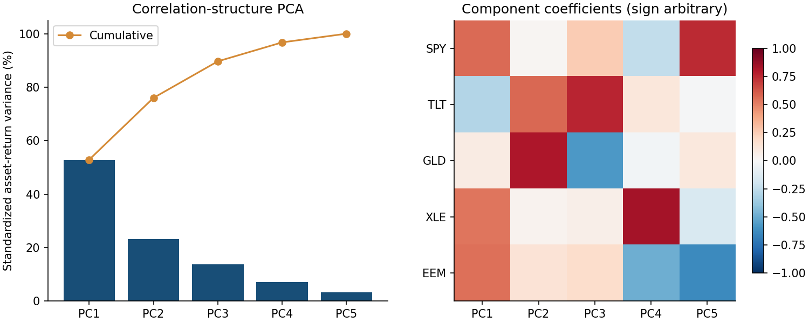
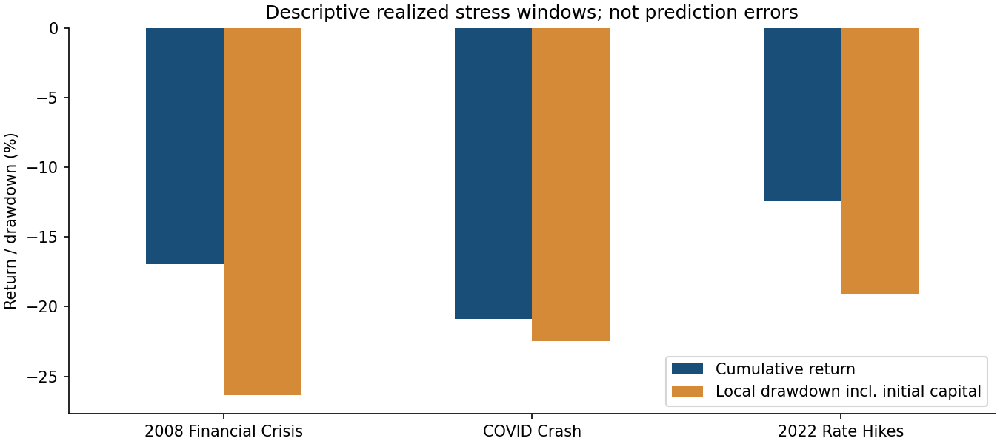

# Frozen-sample Market Risk Results

Price observations: **2008-01-02 to 2026-08-31**, 4,695 dates.
Retrieved: 2026-09-06T21:42:16.700354+00:00. These replace the unverified historical README snapshot; they were not fitted to its numbers.

## Rolling 95% historical VaR

**230 exceptions / 4,442 forecast days = 5.18%**, versus 5.00% expected.
Forecast dates: 2009-01-02 to 2026-08-31. Each forecast uses only the preceding 252 returns.

| Test | LR statistic | p-value | Decision at 5% |
|---|---:|---:|---|
| kupiec_pof | 0.292525 | 0.588607 | do_not_reject |
| christoffersen_independence | 9.268000 | 0.00233192 | reject |
| christoffersen_conditional_coverage | 9.560524 | 0.0083938 | reject |

The POF null is a 5% unconditional exception probability; independence tests first-order dependence in adjacent hits. Combined coverage tests both restrictions. Failure to reject is not proof of accuracy; tests are asymptotic and do not establish regulatory compliance.
Transitions: `{'n00': 4004, 'n01': 207, 'n10': 207, 'n11': 23}`. A 252-day rolling exception plot is descriptive, not a Basel traffic light.

## Full-sample descriptive tail estimates

Signed daily returns: more negative means a larger loss. Estimates use the same full sample; they are not forward forecasts.

| Method | 95% VaR | 95% ES |
|---|---:|---:|
| Historical | -1.13% | -1.88% |
| Gaussian | -1.28% | -1.62% |
| Monte Carlo (Gaussian draws) | -1.28% | -1.62% |

## Realized stress windows

| Scenario | Days | Cumulative return | Drawdown from initial/local peak | Window 95% VaR | / full-sample magnitude |
|---|---:|---:|---:|---:|---:|
| 2008 Financial Crisis | 146 | -16.92% | -26.36% | -3.61% | 3.19x |
| COVID Crash | 24 | -20.90% | -22.48% | -5.96% | 5.26x |
| 2022 Rate Hikes | 251 | -12.44% | -19.06% | -1.59% | 1.40x |

These compare quantiles computed within historical windows against a full-sample quantile that includes the crises. A ratio is NOT evidence of an ex-ante forecast miss. The short COVID window makes its empirical tail quantile particularly imprecise. Drawdown includes capital before the first window return, but not peaks before the window.

## PCA of standardized asset returns

The first two components explain **75.99%** and the first three **89.66%** of standardized asset-return variance.
This is the five-asset correlation structure. Portfolio weights are not PCA inputs, so this is not a decomposition of portfolio variance. Component signs and economic interpretations are not identified uniquely.

## What is and is not validated

- Raw vendor response, adjusted-close CSV, immutable hashes, parameters, numerical results and dated exception series are stored together.
- Regression tests check frozen headline results; separate formula tests check coverage calculations. Reproducibility is not proof of financial validity.
- Fixed weights are rebalanced daily without costs. Asset selection/weights are retrospectively specified; vendor data were acquired after the sample end. The rolling calculation excludes the forecast return but is not a point-in-time production record.
- No arbitrary 5%/8% regulatory classification remains in the current workflow. Historical audit notes are preserved as dated records, not current methodology.
- No resume claims should imply a production deployment, official model approval, strategy alpha, or causal evidence from descriptive stress/PCA analysis.

## Outputs

Sources: [Kupiec POF](https://www.mathworks.com/help/risk/varbacktest.pof.html), [Christoffersen independence](https://www.mathworks.com/help/risk/varbacktest.cci.html), [conditional coverage](https://www.mathworks.com/help/risk/varbacktest.cc.html).
